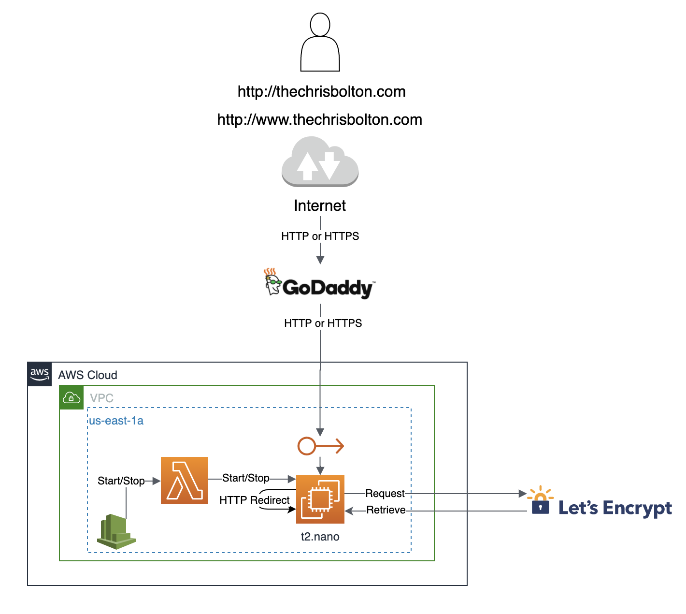

# The Chris Bolton

### Prerequisites

**npm 6.4.1** \
**node v10.15.3** \
**docker (optional)**

### Local Development

1. Git clone: `git clone https://github.com/Gl4di4torRr/chrisbolton.git`
2. Change Directory: `cd chrisbolton`
3. Install Dependencies: `npm install`
4. Run: Open `index.html` in a browser to display static content

### Building the docker image

#### Building locally

Run: `docker build . -t chrisbolton`

#### Building with Quay

I am using [Red Hat's Quay Registry](https://quay.io/repository/gl4di4torrr/chrisbolton) to build and store the docker images.
The registry will build from the master branch on github.

### Running as a docker container with Let's Encrypt

This assumes you have created a certificate at `/etc/letsencrypt/live/thechrisbolton.com/` with 
`certbot`.

```
docker run --restart "unless-stopped"
		   -p 80:80 \
           -p 443:443 \
           -v /etc/letsencrypt/live/thechrisbolton.com/:/etc/letsencrypt/live/thechrisbolton.com \
           -v /etc/letsencrypt/archive/:/etc/letsencrypt/archive \
           --name chrisbolton \
           -d quay.io/gl4di4torrr/chrisbolton:latest
```

### Conceptual Architecture Diagram


